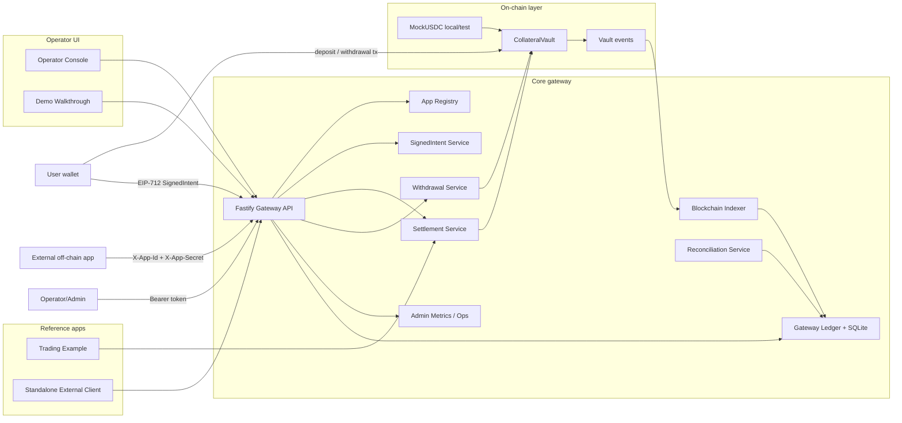

# Architecture

Collateral Settlement Gateway is a reusable Web3 reference architecture for applications that need fast off-chain logic with on-chain collateral custody, auditable settlement, guarded withdrawals, and reconciliation.

Trading is a reference application. The reusable boundary is the gateway: Vault custody, EIP-712 signed intents, app authorization, settlement-intent linkage, withdrawal controls, indexing, reconciliation, admin metrics, and audit reports.

## Product boundary

Core gateway responsibilities:

- on-chain `CollateralVault` deposits, insurance liquidity, guarded withdrawals, settlement IDs, and settlement events;
- EIP-712 `SignedIntent` verification and replay prevention;
- app registry for external application authorization;
- generic settlement API with linked `signedIntentIds`;
- settlement audit reports connecting on-chain events, `reasonHash`, off-chain references, and signed intents;
- user-signed withdrawal requests plus operator approval;
- blockchain indexing and reconciliation;
- admin/operator APIs and Operator Console.

Application-specific modules such as trading, prediction markets, games, competitions, or reward engines can live outside the gateway and integrate through the same API.

## Architecture diagram

## Core gateway flow

1. **Deposit collateral** — users deposit collateral into `CollateralVault`; the indexer and ledger reflect the deposit.
2. **Signed intent** — users authorize off-chain actions by signing EIP-712 `SignedIntent` messages.
3. **Off-chain app logic** — an app calculates outcomes off-chain and prepares settlement metadata and references.
4. **App-authorized settlement** — `POST /settlements` requires either admin bearer auth or `X-App-Id`/`X-App-Secret`; app-auth settlements must include linked signed intents.
5. **Settlement-intent linkage** — linked intents must be `VERIFIED`, same user, same app, unexpired, and unconsumed; after settlement they become `CONSUMED`.
6. **Audit report** — `GET /settlements/:settlementId/report` shows settlement, reason hash, linked intents, accounting conversion, and on-chain event data.
7. **User-signed withdrawal** — public withdrawal request requires a `WITHDRAWAL_REQUEST` signed intent; operator approval is a separate guarded step.
8. **Reconciliation** — admin APIs compare backend ledger state and Vault state.

## Production path

Production hardening should add fixed-point integer storage end-to-end, Postgres, DB-managed app registry, RBAC, multisig/governed operator signing, robust oracle policy, settlement batching/review, dispute windows, monitoring, testnet/mainnet runbooks, and smart contract/backend audits.
